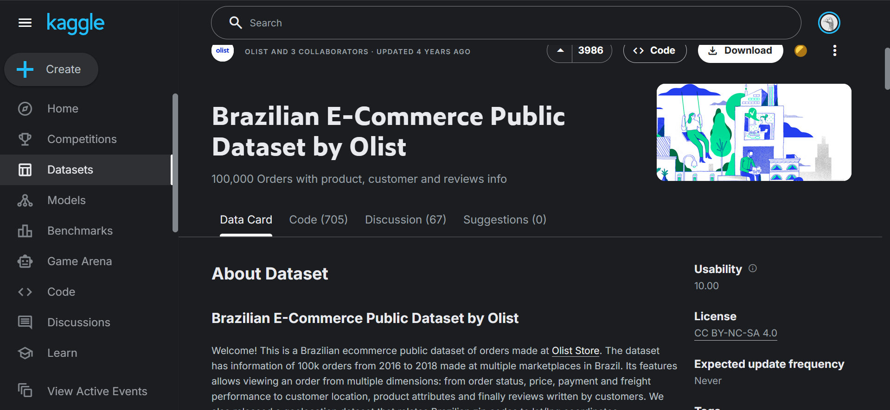

# **E-Commerce Sales and Delivery Performance Analysis Using Power BI**

**Group Members:**

* Arlen Ngahu - 667855

**Class:** Business Organization and Data Visualization Course - DSA3050A
**Semester:** Spring 2026

## Project Overview

In this project, we analyzed an e-commerce dataset to understand sales performance, customer distribution, and delivery efficiency. The goal of the analysis was to transform raw transactional data into meaningful insights that can support business decision-making.

Using Microsoft Power BI, we cleaned and prepared the dataset, built a structured data model, and created interactive dashboards that highlight key business metrics such as revenue trends, regional sales performance, product category demand, and delivery timelines.

The project workflow consisted of several major stages:

1. **Data Preparation (Power Query)** – Cleaning, merging, and transforming the raw data.
2. **Data Modeling** – Establishing relationships between tables to support analysis.
3. **Feature Engineering** – Creating calculated columns and measures for key metrics.
4. **Data Visualization** – Building dashboards that communicate insights effectively.

Through this process, the project demonstrates how **business intelligence tools can be used to convert raw data into actionable insights** for monitoring operational performance and identifying opportunities for improvement.

## Tools Used

* **Microsoft Power BI**
* **Power Query**
* **DAX (Data Analysis Expressions)**

## Dataset Description

The dataset used in this project contains transactional information from an e-commerce platform. It includes multiple related tables covering:

* Customer information
* Orders
* Order items
* Product details
* Payment information
* Delivery timestamps
* Geographic data

These tables were merged and transformed during the **Power Query data preparation stage** to create a structured dataset suitable for analysis.

## Project Sections

1. Power Query Data Preparation
2. Data Modeling
3. DAX Measures and Calculations
4. Dashboard Design and Visualizations
5. Key Insights and Findings

## Power Query Data Preparation and Transformation

In this stage of the project, I used **Power Query in Microsoft Power BI** to clean, transform, and prepare the raw e-commerce dataset for analysis. Although the dataset was relatively structured, I still performed several transformations to ensure that the data model was consistent, reliable, and suitable for analytical reporting. Each transformation step is documented below.

## 1. Loading the Raw Dataset

I started by importing the raw CSV datasets into Power BI. These included the core transaction dataset and the related tables used to enrich it.

After loading the files, I opened **Power Query Editor** and inspected the structure of each table to understand the available columns, data types, and potential issues such as missing values or inconsistent formats.

## 2. Merging Related Tables

Because the original data was stored across several relational tables, I decided to merge them into a single enriched analytical table. I used **Merge Queries** in Power Query to join the tables using their key fields.

I began with the **order items table** as the base table because it represents the most granular transaction level (each row corresponds to a product in an order).

I then merged the following tables:

* Orders table (joined using `order_id`)
* Products table (joined using `product_id`)
* Customers table (joined using `customer_id`)
* Payments table (joined using `order_id`)

For each merge operation, I used a **Left Outer Join** so that all records from the base table were preserved.

After performing the joins, I expanded only the columns necessary for analysis, such as order timestamps, product categories, customer location information, and payment details.

<!-- INSERT SCREENSHOT: Merge Queries dialog showing the join between tables -->

<!-- INSERT SCREENSHOT: Expanded columns after merging tables -->

---

## 3. Renaming Columns for Clarity

After merging the tables, I noticed that several column names were long or not immediately intuitive for analysis. I decided to rename them to improve clarity and readability.

Examples of renaming include:

* `order_purchase_timestamp` → `Order_Date`
* `product_category_name` → `Product_Category`
* `payment_value` → `Payment_Amount`

This step ensures that the dataset is easier to understand when building visualizations and writing DAX measures later in the project.

<!-- INSERT SCREENSHOT: Renamed columns in Power Query -->

---

## 4. Correcting Data Types

Next, I verified and corrected the data types of all columns to ensure consistency.

For example:

* Date columns were converted to **Date/Time**
* Price and payment columns were converted to **Decimal Number**
* Categorical attributes such as product category and customer state were set to **Text**

Correct data types are important because they allow Power BI to perform calculations correctly and avoid errors during analysis.

<!-- INSERT SCREENSHOT: Data type adjustments in Power Query -->

---

## 5. Removing Duplicate Records

To maintain data integrity, I checked for duplicate rows in the dataset.

I removed duplicates using the combination of:

`order_id + order_item_id`

This ensured that each row in the dataset represents a unique item within an order.

Removing duplicates prevents inaccurate calculations in measures such as total sales or total orders.

<!-- INSERT SCREENSHOT: Remove Duplicates step in Power Query -->

---

## 6. Handling Missing Values

During inspection, I noticed that some delivery-related fields contained missing values.

Instead of replacing these values arbitrarily, I decided to create a **Shipping Status** indicator column. This column classifies each order based on whether a delivery date exists.

The logic used was:

* If the delivery date is null → "Not Delivered"
* Otherwise → "Delivered"

This approach preserves the original data while still enabling meaningful analysis of delivery performance.

<!-- INSERT SCREENSHOT: Conditional column creation -->

---

## 7. Creating Delivery Time Metrics

To enable delivery performance analysis, I created a custom column to calculate the number of days between the order purchase date and the actual delivery date.

This column calculates the **delivery duration in days**, which will later be used in dashboard visuals and KPI calculations.

<!-- INSERT SCREENSHOT: Custom column formula calculating delivery days -->

---

## 8. Extracting Date Components

To support time-based analysis, I extracted several components from the order purchase date.

The following columns were created:

* Year
* Month Number
* Month Name
* Quarter
* Day Name

These fields allow the dashboard to analyze trends such as monthly sales patterns and quarterly performance.

<!-- INSERT SCREENSHOT: Extracted date components -->

---

## 9. Creating Regional Groupings

The dataset included customer locations at the **state level**, which can be too granular for some business insights. To simplify geographic analysis, I created a new **Region** column that groups states into Brazil’s major geographic regions.

For example:

* SP, RJ, MG, ES → Southeast
* PR, RS, SC → South
* BA, PE, CE, etc. → Northeast

This transformation enables higher-level geographic comparisons such as **sales by region** and **delivery performance by region**.

<!-- INSERT SCREENSHOT: Custom column used to group states into regions -->

---

## 10. Creating Additional Analytical Columns

Finally, I created additional derived columns that help support business metrics used later in the dashboard.

Examples include:

* **Order Total** (product price + freight value)
* **Delivery Delay** (difference between estimated delivery and actual delivery)

These calculated columns enhance the dataset by introducing metrics that directly relate to operational and financial performance.

<!-- INSERT SCREENSHOT: Additional calculated columns -->

---

## Summary of Power Query Transformations

Through the Power Query process, I completed several key data preparation steps:

* Merged multiple relational tables
* Renamed columns for clarity
* Corrected data types
* Removed duplicate records
* Handled missing values
* Created delivery performance metrics
* Extracted date components
* Grouped customer states into regions
* Generated additional analytical columns

These transformations ensured that the dataset was clean, structured, and ready for **data modeling, DAX calculations, and dashboard development** in the subsequent stages of the project.

<!-- INSERT SCREENSHOT: Final cleaned dataset in Power Query -->
